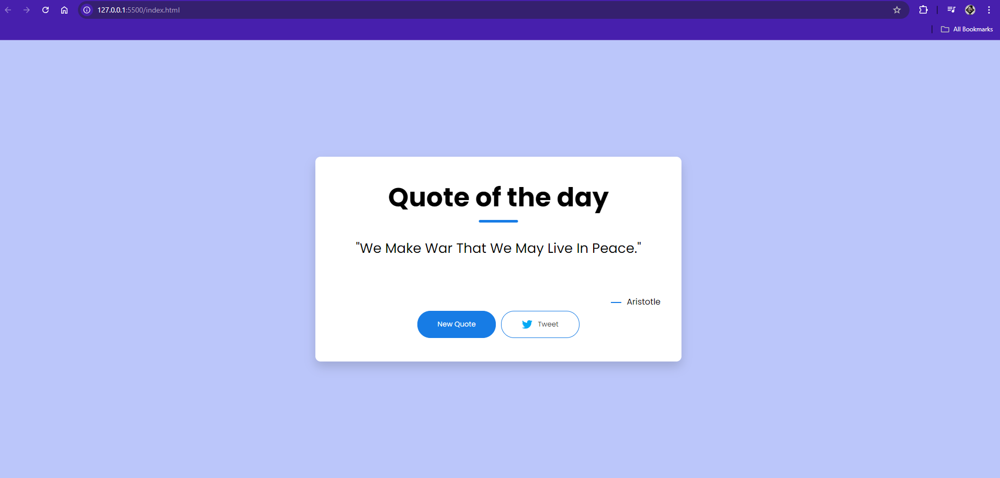
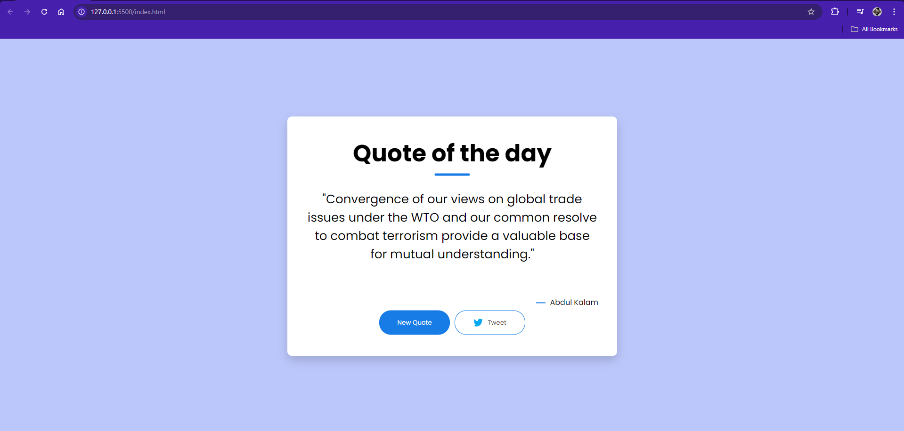
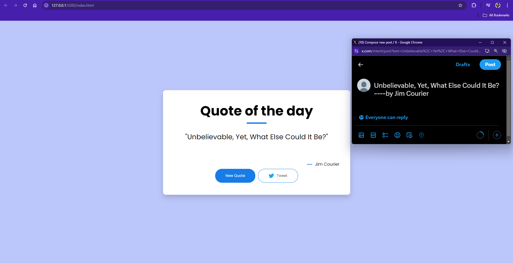

## Quote of the Day
**Overview** -
    The Quote of the Day application fetches and displays a random inspirational quote from an API. Users can generate a new quote at the click of a button and share it directly on Twitter. This app is designed to inspire and motivate users with fresh quotes every day.

## Features
- Fetches a random quote from the API.
- Displays the quote and its author.
- Allows users to generate a new quote.
- Enables users to share the quote on Twitter.

## Technologies Used
- HTML
- CSS
- JavaScript

## Usage
- **Load the Application:**- Upon loading, a random quote is fetched and displayed.
- **Generate a New Quote:** - Click the "New Quote" button to fetch a new random quote.
- **Share on Twitter:** -Click the "Tweet" button to open a new window and share the quote on Twitter.

## Screenshots
    Here's a brief overview of the functionality of the app:
    






## Code Snippet
    Here's a brief overview of the main functionality:


```HTML
<div class="quote-box">  
    <h2>Quote of the day</h2>
    <blockquote id="quote">Loading...</blockquote>
    <span id="author">Loading...</span>
    
    <div>
        <button id="newQuote" onclick="getQuote(api_url)">New Quote</button>
        <button onclick="tweet()"> Tweet</button>
    </div>
</div>
```


```JavaScript
const quote = document.getElementById('quote');
const author = document.getElementById('author');
const api_url = 'https://dummyjson.com/quotes/random';

async function getQuote(url) {
    try {
        const response = await fetch(url);
        const data = await response.json();

        quote.innerHTML = data.quote ?? "Quote not available";
        author.innerHTML = data.author ? `— ${data.author}` : "Unknown author";
    } catch (error) {
        quote.innerHTML = "Failed to fetch quote.";
        author.innerHTML = "";
    }
}

function tweet() {
    const tweetText = `${quote.innerHTML} ---- by ${author.innerHTML}`;
    window.open(`https://twitter.com/intent/tweet?text=${encodeURIComponent(tweetText)}`, 'Tweet Window', 'width=600,height=400');
}

```